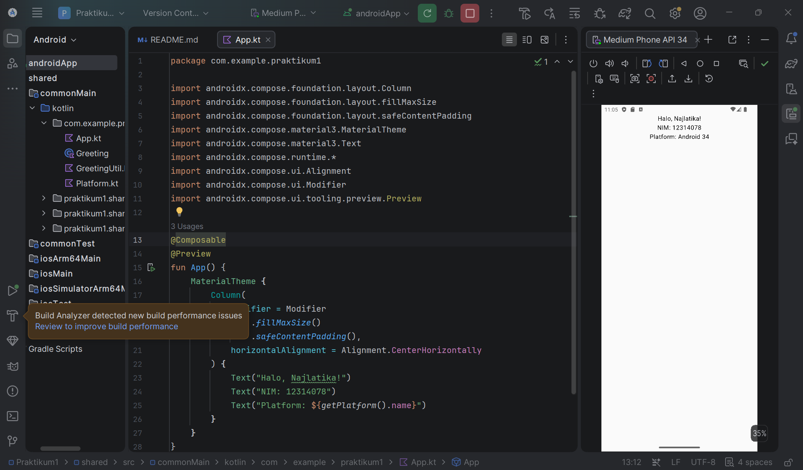

# Praktikum 1 - KMP Hello World

## Identitas
- Nama: Najlatika
- NIM: 12314078
- Mata Kuliah: Pengembangan Aplikasi Mobile

## Deskripsi
Praktikum 1 membuat aplikasi sederhana menggunakan Kotlin Multiplatform (KMP) dengan Compose Multiplatform.

Aplikasi menampilkan:
- Nama mahasiswa
- NIM mahasiswa
- Platform tempat aplikasi dijalankan

## Platform
Aplikasi berhasil dijalankan pada:
- Android
- Android 14 (API 34)

## Cara Menjalankan
1. Buka project menggunakan Android Studio.
2. Pastikan Android SDK dan Kotlin Multiplatform Plugin sudah tersedia.
3. Jalankan emulator Android.
4. Pilih konfigurasi androidApp.
5. Klik tombol Run.
6. Aplikasi akan menampilkan nama, NIM, dan platform.

## Hasil
Aplikasi berhasil dijalankan pada emulator Android dengan tampilan nama, NIM, dan informasi platform.

## Screenshot Hasil Aplikasi

